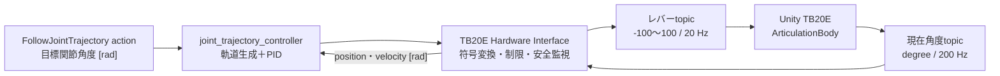

# 2026-07-30 TB20e レバー入力・PID制御

## User

OperaSim-PhysXとtb20e_ros2に以下の機能を追加してほしい．

### OperaSim-PhysX

- tb20eにレバー入力を再現するスクリプトの実装
- インスペクタでtopic名を編集できるようにして
- 操作指令を受け取ってArticulation Bodyのtarget角度を更新するように
- toipc名と仕様は以下のとおりです
  - 操作指令（msg型: std_msgs/msg/Float64, 周期: 50ms, 値: -100.0 ~ 100.0）
    - /manipulated_boom_lever
    - /manipulated_arm_lever
    - /manipulated_bucket_lever
    - /manipulated_swing_lever

### tb20e_ros2

- zx200_ros2を参考に，ros2でtb20eのPID制御ができるようにして
- toipc名と仕様は以下のとおりです
  - 操作指令（msg型: std_msgs/msg/Float64, 周期: 50ms, 値: -100.0 ~ 100.0）
    - /manipulated_boom_lever
    - /manipulated_arm_lever
    - /manipulated_bucket_lever
    - /manipulated_swing_lever
  - 現在角度（msg型: std_msgs/msg/Float64, 周期: 5ms）
    - /current_boom_angle （値: 48 ~ -83）
    - /current_arm_angle （値: 32 ~ 155）
    - /current_bucket_angle （値: -31 ~ 159）
    - /current_swing_angle （値: -180 ~ 180）

参照ファイル:

- `/Users/iszw/Library/Mobile Documents/iCloud~md~obsidian/Documents/obsidian/ExcavProject/takeuchi_docs/ROS Topic仕様.pdf`

## Assistant commentary

PDFの仕様を確認しつつ、3リポジトリの既存実装を並行調査してから、Unity側とROS 2側を実装・検証します。PDFの読み取りにはPDFスキルを使い、既存の `zx200_ros2` の制御構成を基準に差分を最小化します。会話履歴もこのセッション用ファイルへ保存します。

PDFは4ページ構成で、テキスト抽出ツールの一部が未同梱だったため、PDFスキルの代替手順（`pdfplumber`＋画像レンダリング）に切り替えます。リポジトリはいずれも作業開始時点で変更なしです。

調査結果から、旋回対象は `swing_link` ではなく上部旋回体の `body_link` で確定しました。角度仕様をシミュレータでも満たすため、旋回topic名を `/current_swing_angle` に合わせ、角度出力を200 Hz・物理固定刻みを5 msへ更新します（物理計算量は増えますが、レバーのdeg/s換算は刻みに依存しない実装にします）。

ROS 2側は、`joint_trajectory_controller` のPID出力をレバー百分率へ変換するhardware pluginとして実装します。`zx200_ros2` の構成を踏襲しつつ、API差異で壊れないよう公式ros2_control仕様も照合しています。

Unity側の実装とscene配線は完了し、静的差分チェックも通りました。続いて指定バージョンのUnityをbatch modeで起動し、実際のC#コンパイルとscene deserializationを確認します。

Unityプロジェクトは別のEditorインスタンスですでに開かれていたため、新しいbatch mode起動は安全に中止されました。開いているEditorのログを読み、同じコンパイル結果を確認します。

開いているUnity Editorは変更後の自動refreshログをまだ出していないため、既存アプリを止めずに状態だけ確認します。このUI確認にはComputer Useスキルを使い、Consoleのコンパイルエラー有無を読み取ります。

既存UnityのUI取得がタイムアウトしたため、Editor操作は行っていません。UIへの干渉は止め、ソースとsceneの静的検証を継続します。Unityの完全な実行確認だけは、現在開いているEditorを閉じた後にbatch modeで再実行できる状態です。

Unityの開いているEditorが変更後に `OperaSimPhysXAssembly.dll` を再生成し、新しい `Tb20eLeverController` 型が含まれることを確認できました。ROS 2側も主要実装は揃い、いまHumble互換・thread lifecycle・stale時のゼロ出力を重点レビュー中です。

ROS 2レビューで、feedback断から復帰した瞬間に進行済み軌道へ再突入し得る点が見つかりました。これを防ぐため、全軸feedbackを確認してからactivateし、運転中のstale/異常値は全軸ゼロ出力のラッチ故障にします。復旧は明示的な再activateと新規goalを必要とする安全側の挙動に直します。

安全側の修正を仕上げています。feedbackの範囲外値・欠落・タイムアウト時に全レバーをゼロへラッチし、再activateまで自動復帰しないことをコードと設定の両方で整合確認します。

静的検証は通過しています。さらに、途中で追加されていた角度変換・旋回wrap・符号/clamp・範囲判定の単体テストを実処理と同じ関数へ接続し、テストが形だけにならないよう整理します。

Unity Editorを停止せずに、Editorが生成済みの同一参照・define一覧を使ってC#アセンブリを一時出力へ再コンパイルします。これで最新の安全修正まで含む構文・参照解決を確認できます。

最終検証まで完了しました。Unity側はUnity生成済みの参照設定でプロジェクトC#全体を再コンパイルして成功、ROS側は設定・XML・Python・数値処理テストを通過しています。残る未実施項目は、このMacにHumble環境がないための`colcon build`とROS–Unity実通信テストです。

## Assistant final

実装完了しました。提供PDFはPDFスキルで全4ページを確認し、レバー正入力と各角度の方向・範囲を実装へ反映しています。

### OperaSim-PhysX

- [Tb20eLeverController.cs](/Users/iszw/git/OperaSim-PhysX/Assets/Scripts/Tb20eLeverController.cs:10) を追加しました。4本の`Float64` topic、操作方向、±100時の角速度をInspectorで軸別に編集でき、入力に応じて`ArticulationBody.xDrive.target`を更新します。
- [SimpleScene.unity](/Users/iszw/git/OperaSim-PhysX/Assets/Scenes/SimpleScene.unity:9721) と [HttpScene.unity](/Users/iszw/git/OperaSim-PhysX/Assets/Scenes/HttpScene.unity:9721) のTB20eへ配線済みです。旋回は実際の上部旋回体である`body_link`を対象にしています。
- 操作量clamp、NaN/Inf停止、非常停止、0.2秒watchdog、有限関節のtarget範囲制限を入れました。
- 現在角度を200 Hzへ変更し、旋回topicを`/current_swing_angle`へ統一しました。[TimeManager.asset](/Users/iszw/git/OperaSim-PhysX/ProjectSettings/TimeManager.asset:5) の固定刻みも5 msです。仕様と競合注意は [README.md](/Users/iszw/git/OperaSim-PhysX/README.md:102) に追記しています。

### tb20e_ros2

- ROS 2 Humble向けの`tb20e_control` packageを新規実装しました。中心は [tb20e_lever_hardware.cpp](/Users/iszw/git/tb20e_ros2/tb20e_control/src/tb20e_lever_hardware.cpp:77)、PID設定は [tb20e_controllers.yaml](/Users/iszw/git/tb20e_ros2/tb20e_control/config/tb20e_controllers.yaml:4)、起動は [tb20e_control.launch.py](/Users/iszw/git/tb20e_ros2/tb20e_control/launch/tb20e_control.launch.py:14) です。
- 4軸の現在角度をdegreeで受信してradianへ変換し、`joint_trajectory_controller`のeffort PID出力をレバー百分率へ変換して20 Hz（50 ms）で配信します。この構成はros2_controlの[SystemInterface仕様](https://control.ros.org/humble/doc/api/classhardware__interface_1_1SystemInterface.html)と[JointTrajectoryControllerのeffort PID仕様](https://control.ros.org/humble/doc/ros2_controllers/joint_trajectory_controller/doc/userdoc.html)に沿っています。
- activate前の4軸fresh確認、角度範囲・速度飛び検査、feedback timeout、全軸ゼロへのfaultラッチ、端点の外向き指令抑止を実装しました。復旧手順は [README.md](/Users/iszw/git/tb20e_ros2/README.md:133) に記載し、Humbleの[公式CLI仕様](https://control.ros.org/humble/doc/ros2_control/ros2controlcli/doc/userdoc.html)とも照合済みです。
- URDFとhardware判定の角度制限は [tb20e.urdf.xacro](/Users/iszw/git/tb20e_ros2/tb20e_control/urdf/tb20e.urdf.xacro:10) の共通値から生成します。角度変換、旋回wrap、符号・clamp、範囲・速度検査のテストも [test_math_utils.cpp](/Users/iszw/git/tb20e_ros2/tb20e_control/test/test_math_utils.cpp:20) に追加しました。

起動はUnity側を先に開始してから実行します。

```bash
colcon build --symlink-install --packages-select tb20e_control
source install/setup.bash
ros2 launch tb20e_control tb20e_control.launch.py
```

Unity側はUnity生成済みの参照・defineを使ったプロジェクトC#全体の再コンパイルに成功しました（既存の無関係な警告3件のみ）。ROS側はXML/YAML/Python検証とC++数値処理のコンパイル・実行に成功しています。このMacにはROS 2 Humbleがないため、`colcon build`、xacro展開、plugin実ロード、ROS–Unity実通信は未実施です。PIDゲインはシミュレータ用の初期値なので、実際の応答を見ながら調整してください。

---

## User

`rosdep install --from-paths src --ignore-src --rosdistro humble -y`

このコマンドを実行したら以下のエラーが出た

```text
**executing command [sudo -H apt-get install -y ros-humble-hardware-interface]**
Reading package lists... Done
Building dependency tree... Done
Reading state information... Done
The following additional packages will be installed:
  ros-humble-control-msgs
The following NEW packages will be installed:
  ros-humble-control-msgs
  ros-humble-hardware-interface
0 upgraded, 2 newly installed, 0 to remove and 438 not upgraded.
Need to get 671 kB of archives.
After this operation, 9574 kB of additional disk space will be used.
Err:1 http://packages.ros.org/ros2/ubuntu jammy/main arm64 ros-humble-control-msgs arm64 4.8.0-1jammy.20260307.215141
  404  Not Found [IP: 140.211.166.134 80]
Err:2 http://packages.ros.org/ros2/ubuntu jammy/main arm64 ros-humble-hardware-interface arm64 2.53.1-1jammy.20260326.135212
  404  Not Found [IP: 140.211.166.134 80]
E: Failed to fetch http://packages.ros.org/ros2/ubuntu/pool/main/r/ros-humble-control-msgs/ros-humble-control-msgs_4.8.0-1jammy.20260307.215141_arm64.deb  404  Not Found [IP: 140.211.166.134 80]
E: Failed to fetch http://packages.ros.org/ros2/ubuntu/pool/main/r/ros-humble-hardware-interface/ros-humble-hardware-interface_2.53.1-1jammy.20260326.135212_arm64.deb  404  Not Found [IP: 140.211.166.134 80]
E: Unable to fetch some archives, maybe run apt-get update or try with --fix-missing?
ERROR: the following rosdeps failed to install
  apt: command [sudo -H apt-get install -y ros-humble-hardware-interface] failed
```

## Assistant commentary

この404は依存関係の定義ではなく、端末に残っているAPTのパッケージ一覧がROSリポジトリ上の実体より古いときに起きる典型例です。現行のROS 2公式リポジトリ設定も確認したうえで、最小の復旧手順を整理します。

まずはROS source設定を触らず、APT一覧の更新だけで直る可能性が高いです。`apt update`後にCandidateが変わったことを確認してから`rosdep`を再実行する手順にします。

## Assistant final

原因は、端末のAPTパッケージ一覧が古く、ROSリポジトリから既に置き換えられた`.deb`のバージョンを参照していることです。`jammy / arm64`はHumbleの対応構成なので、アーキテクチャ不一致ではありません。

まず次を実行してください。

```bash
sudo apt-get update

apt-cache policy \
  ros-humble-control-msgs \
  ros-humble-hardware-interface

sudo apt-get install -y ros-humble-hardware-interface
```

インストールできたら、ROS 2ワークスペースのルートで再実行します。

```bash
cd ~/ros2_ws
rosdep update
rosdep install --from-paths src --ignore-src --rosdistro humble -y
```

`rosdep update`には`sudo`を付けないでください。また、今回の404に`--fix-missing`を付けても、古いURLを再試行するだけなので根本解決にはなりません。

もし`sudo apt-get update`自体が失敗する、または更新後も同じ`20260307`／`20260326`版を要求する場合は、ROS公式のAPT source packageを更新します。現在の公式方式では`ros2-apt-source`が鍵とsource設定を管理します。[ROS Infrastructureの公式ros-apt-source](https://github.com/ros-infrastructure/ros-apt-source)

```bash
sudo apt-get update
sudo apt-get install -y curl

export ROS_APT_SOURCE_VERSION="$(
  curl -s https://api.github.com/repos/ros-infrastructure/ros-apt-source/releases/latest \
    | grep -F '"tag_name"' \
    | awk -F'"' '{print $4}'
)"

curl -L -o /tmp/ros2-apt-source.deb \
  "https://github.com/ros-infrastructure/ros-apt-source/releases/download/${ROS_APT_SOURCE_VERSION}/ros2-apt-source_${ROS_APT_SOURCE_VERSION}.$(. /etc/os-release && echo "${UBUNTU_CODENAME:-${VERSION_CODENAME}}")_all.deb"

sudo dpkg -i /tmp/ros2-apt-source.deb
sudo apt-get update
sudo apt-get install -y ros-humble-hardware-interface
```

その後、もう一度`rosdep install`を実行してください。Humbleは現在もサポート対象で、Ubuntu 22.04 Jammy向けパッケージが提供されています。[ROS 2 Humbleのリリース情報](https://docs.ros.org/en/humble/Releases.html)

## User

```text
**executing command [sudo -H apt-get install -y ros-humble-warehouse-ros-mongo]**
Reading package lists... Done
Building dependency tree... Done
Reading state information... Done
E: Unable to locate package ros-humble-warehouse-ros-mongo
ERROR: the following rosdeps failed to install
  apt: command [sudo -H apt-get install -y ros-humble-warehouse-ros-mongo] failed
```

## Assistant commentary

これは前回の404とは別で、APT一覧にはそのパッケージ名自体が存在しない状態です。`tb20e_control`の依存には含めていないため、まずどの`src`パッケージが`warehouse_ros_mongo`を要求しているかと、Humble arm64での配布状況を切り分けます。

ローカル側でも確認しましたが、現在開いているOperaSim側には `warehouse_ros_mongo` への依存記述がありません。今回の依存は、ROS 2ワークスペースの `src` に同居する別パッケージから拾われている可能性が高いです。

## Assistant final

今回のエラーは、`rosdep --from-paths src`が`src`全体を走査し、TB20Eとは別のパッケージが要求する`warehouse_ros_mongo`までインストールしようとしている可能性が高いです。

まず要求元を確認してください。

```bash
cd ~/ros2_ws
grep -Rns --include='package.xml' 'warehouse_ros_mongo' src
```

TB20Eだけをビルドしたい場合は、依存解決の対象もTB20Eに限定します。配置先が`src/tb20e_ros2`の場合は次のとおりです。

```bash
cd ~/ros2_ws
rosdep install \
  --from-paths src/tb20e_ros2 \
  --ignore-src \
  --rosdistro humble \
  -y

colcon build --symlink-install --packages-select tb20e_control
```

これで`warehouse_ros_mongo`が要求されなければ、その依存はTB20Eには不要です。

一方、要求元のパッケージも必要なら、まずバイナリが取得可能か確認します。

```bash
sudo apt-get update
apt-cache policy ros-humble-warehouse-ros-mongo
```

`Candidate: (none)`または何も表示されない場合は、現在設定されているarm64向けAPTリポジトリから取得できません。その場合はソースをワークスペースへ追加します。

```bash
cd ~/ros2_ws/src
git clone --branch ros2 \
  https://github.com/ros-planning/warehouse_ros_mongo.git

cd ~/ros2_ws
rosdep install --from-paths src --ignore-src --rosdistro humble -y
colcon build --symlink-install
```

ソースが`src`内にあれば、`--ignore-src`により同じパッケージのAPTインストールは通常スキップされます。ROS IndexではHumble向け`warehouse_ros_mongo`のソースと`ros2`ブランチが案内されています。[ROS Index: warehouse_ros_mongo](https://index.ros.org/p/warehouse_ros_mongo/) MoveItのHumble文書でも、APTで取得できない場合に同リポジトリを`src`へチェックアウトしてビルドする手順が示されています。[MoveIt Humble: Persistent Scenes and States](https://moveit.picknik.ai/humble/doc/examples/persistent_scenes_and_states/persistent_scenes_and_states.html)

`--skip-keys warehouse_ros_mongo`だけで無理に進める方法もありますが、要求元パッケージを実際に使う場合は実行時エラーにつながるため、TB20Eだけに対象を限定するか、必要ならソース導入するのが安全です。

## User

```text
ubuntu@e23e6d93a717:~/ros2_ws$ grep -Rns --include='package.xml' 'warehouse_ros_mongo' src
src/zx200_ros2/zx200_moveit_config/package.xml:44:  <!-- <exec_depend>warehouse_ros_mongo</exec_depend> -->
src/zx200_ros2/zx200_bringup/package.xml:35:  <exec_depend>warehouse_ros_mongo</exec_depend>
ubuntu@e23e6d93a717:~/ros2_ws$ sudo apt-get update
apt-cache policy ros-humble-warehouse-ros-mongo
Hit:1 http://packages.ros.org/ros2/ubuntu jammy InRelease
Hit:2 http://ports.ubuntu.com/ubuntu-ports jammy InRelease
Hit:3 http://ports.ubuntu.com/ubuntu-ports jammy-updates InRelease
Hit:4 http://ports.ubuntu.com/ubuntu-ports jammy-backports InRelease
Hit:5 http://ports.ubuntu.com/ubuntu-ports jammy-security InRelease
Reading package lists... Done
N: Unable to locate package ros-humble-warehouse-ros-mongo
```

## Assistant commentary

原因が特定できました。APT設定ではなく、`zx200_bringup/package.xml`の有効な`exec_depend`が要求元です。TB20Eの作業だけなら、このMongoDB依存を解決する必要はありません。用途別に安全な対処を整理します。

## Assistant final

原因は`zx200_bringup/package.xml`の35行目です。`zx200_moveit_config`側はコメントアウト済みなので影響しません。また、APT更新は正常ですが、現在のHumble/Jammy arm64リポジトリには対象バイナリがありません。

TB20Eの開発だけなら、次のどちらかで進められます。

推奨はTB20Eだけを依存解決・ビルドする方法です。

```bash
cd ~/ros2_ws

rosdep install \
  --from-paths src/tb20e_ros2 \
  --ignore-src \
  --rosdistro humble \
  -y

colcon build --symlink-install --packages-select tb20e_control
```

ワークスペース全体の依存解決が必要でも、ZX200のMongoDB保存機能を使わないなら、今回判明したキーだけ除外できます。

```bash
cd ~/ros2_ws

rosdep install \
  --from-paths src \
  --ignore-src \
  --rosdistro humble \
  --skip-keys warehouse_ros_mongo \
  -y
```

恒久的には、未使用の依存を`src/zx200_ros2/zx200_bringup/package.xml`でコメントアウトするのが分かりやすいです。

```xml
<!-- MongoDBによるMoveItデータ保存を使う場合のみ必要 -->
<!-- <exec_depend>warehouse_ros_mongo</exec_depend> -->
```

ZX200でMoveItのシーンや状態をMongoDBへ保存する機能も必要な場合だけ、ソース導入します。

```bash
cd ~/ros2_ws/src
git clone --branch ros2 \
  https://github.com/ros-planning/warehouse_ros_mongo.git

cd ~/ros2_ws
rosdep install --from-paths src --ignore-src --rosdistro humble -y
colcon build --symlink-install
```

`warehouse_ros_mongo`はROSメッセージをMongoDBへ永続保存するためのプラグインであり、TB20EのPID制御やレバー指令には関係ありません。[ROS Humble documentation](https://docs.ros.org/en/humble/p/warehouse_ros_mongo/) したがって、今回の用途では対象限定または`--skip-keys`で問題ありません。

## User

ros2 actionがうまく動かない

```text
ubuntu@e23e6d93a717:~/ros2_ws$ ros2 action send_goal   /tb20e_controller/follow_joint_trajectory   control_msgs/action/FollowJointTrajectory   "{trajectory: {joint_names: [swing_joint, boom_joint, arm_joint, bucket_joint], points: [{positions: [0.0, -0.35, 1.40, 0.52], velocities: [0.0, 0.0, 0.0, 0.0], time_from_start: {sec: 5}}]}}"
Waiting for an action server to become available...
Sending goal:
     trajectory:
  header:
    stamp:
      sec: 0
      nanosec: 0
    frame_id: ''
  joint_names:
- swing_joint
- boom_joint
- arm_joint
- bucket_joint
  points:
- positions:
  - 0.0
  - -0.35
  - 1.4
  - 0.52
  velocities:
  - 0.0
  - 0.0
  - 0.0
  - 0.0
  accelerations: []
  effort: []
  time_from_start:
  sec: 5
  nanosec: 0
multi_dof_trajectory:
  header:
    stamp:
      sec: 0
      nanosec: 0
    frame_id: ''
  joint_names: []
  points: []
path_tolerance: []
component_path_tolerance: []
goal_tolerance: []
component_goal_tolerance: []
goal_time_tolerance:
  sec: 0
  nanosec: 0

Goal accepted with ID: a25b536116fa437bb2244ea061b66eb1

Result:
    error_code: -5
error_string: Aborted due to goal_time_tolerance exceeding by 5.004319 seconds

Goal finished with status: ABORTED
```

## Assistant commentary

Action serverとの通信自体は成功しています。`Goal accepted`後の`error_code: -5`は、指定した5秒後までに関節状態が目標許容範囲へ入らなかった、という制御側の異常です。まず「現在角度がcontrollerまで届いているか」「単位がradで一致しているか」「controllerの制約値」を切り分けます。

今回の実装には、現在角度の途切れ・範囲外・急激な飛びを検出すると全レバーを0に固定する安全ラッチがあります。したがって最有力は、Unityの角度topicが停止または異常判定され、その後PID出力が無効化されたケースです。単に`goal_time_tolerance`を延ばしても、関節が動いていなければ解決しません。

## Assistant final

Action通信は正常です。`error_code: -5`は`GOAL_TOLERANCE_VIOLATED`で、目標時刻5秒＋設定された猶予5秒を過ぎても、実角度が目標へ到達しなかったことを示します。送信した目標値もrad単位で、各関節の範囲内です。

まずUnityをPlay状態にしたまま、次を確認してください。

```bash
ros2 control list_controllers
ros2 topic echo /joint_states --once

timeout 3 ros2 topic hz /current_swing_angle
timeout 3 ros2 topic hz /current_boom_angle
timeout 3 ros2 topic hz /current_arm_angle
timeout 3 ros2 topic hz /current_bucket_angle
```

正常な状態は次のとおりです。

- `tb20e_controller`と`joint_state_broadcaster`が`active`
- `/joint_states`に4軸が存在し、positionがrad単位
- 4つの`/current_*_angle`が約200 Hzで受信できる

次に、別ターミナルでレバー出力を監視しながら、フィードバック付きでgoalを送ります。

```bash
ros2 topic echo /manipulated_boom_lever
```

```bash
ros2 action send_goal --feedback \
  /tb20e_controller/follow_joint_trajectory \
  control_msgs/action/FollowJointTrajectory \
  "{trajectory: {joint_names: [swing_joint, boom_joint, arm_joint, bucket_joint], points: [{positions: [0.0, -0.35, 1.40, 0.52], velocities: [0.0, 0.0, 0.0, 0.0], time_from_start: {sec: 5}}]}}"
```

結果の見方は以下です。

| 状態 | 原因 |
|---|---|
| `/current_*_angle`が出ない | Unityが未再生、ROS接続または角度Publisherの問題 |
| 現在角度は出るがレバー値が常に0 | hardware pluginの安全ラッチ、controller設定またはfeedback異常 |
| レバー値は非0だが角度が変化しない | Unity側のsubscriber、topic名、ArticulationBody配線の問題 |
| 角度が目標と逆方向へ動く | 対象軸のPIDまたはUnity側レバー方向の符号が逆 |
| 角度は動くが届かない | PIDゲイン、速度、goal toleranceの調整が必要 |

この実装は角度topicの欠落・範囲外・急変を検出すると、全レバーを0へ固定する安全ラッチを持っています。起動したターミナルに`feedback timeout`、`out of range`、`velocity`、`fault latched`などが出ていないか確認してください。一度ラッチした場合は、原因を直してUnityを先にPlay状態にし、4つの角度topicが流れていることを確認してから、ROSのlaunchを再起動します。

```bash
# ROS launchをCtrl+Cで終了後
ros2 launch tb20e_control tb20e_control.launch.py
```

特に確認したいのは、以下の3つの出力です。

```bash
ros2 control list_controllers
ros2 topic echo /joint_states --once
timeout 3 ros2 topic hz /current_boom_angle
```

これらと、goal送信中の`/manipulated_boom_lever`の値が分かれば、ROS側とUnity側のどちらで止まっているか確定できます。

## User

```text
ubuntu@e23e6d93a717:~/ros2_ws$ ros2 control list_controllers
usage: ros2 [-h] [--use-python-default-buffering]
            Call `ros2 <command> -h` for more detailed usage. ...
ros2: error: argument Call `ros2 <command> -h` for more detailed usage.: invalid choice: 'control' (choose from 'action', 'bag', 'component', 'daemon', 'doctor', 'extension_points', 'extensions', 'interface', 'launch', 'lifecycle', 'multicast', 'node', 'param', 'pkg', 'run', 'security', 'service', 'topic', 'wtf')
ubuntu@e23e6d93a717:~/ros2_ws$ ros2 topic echo /joint_states --once
header:
  stamp:
    sec: 1785394422
    nanosec: 115934216
  frame_id: base_link
name:
- swing_joint
- boom_joint
- arm_joint
- bucket_joint
position:
- 0.008629931237701376
- -1.448606150370295
- 2.705238850700039
- 1.5533442678572258
velocity:
- 1.1723462036231741e-05
- 0.0
- 0.0
- 0.0
effort:
- .nan
- .nan
- .nan
- .nan
---
```

## Assistant commentary

`ros2 control`が使えない理由は、制御ノードの故障ではなくCLI拡張パッケージ`ros2controlcli`が未インストールだからです。一方、`/joint_states`は4軸とも正常なrad値を返しており、角度feedback経路は少なくとも動作しています。次はCLIを追加し、controller状態とレバー出力を確認します。

## Assistant final

`/joint_states`は正常に取得できています。現在値をdegreeへ戻すと、およそ次の状態です。

- swing: `0.49°`
- boom: `-83.0°`（下限付近）
- arm: `155.0°`（上限付近）
- bucket: `89.0°`

`effort: .nan`は、hardwareがeffortの状態値を提供していないためで、今回の異常原因ではありません。

`ros2 control`が存在しないのは、CLI拡張が未インストールだからです。ROS 2公式のHumble手順どおり、メタパッケージを追加します。

```bash
sudo apt-get update
sudo apt-get install -y \
  ros-humble-ros2-control \
  ros-humble-ros2-controllers

source /opt/ros/humble/setup.bash
source ~/ros2_ws/install/setup.bash

ros2 control list_controllers
ros2 control list_hardware_interfaces
```

公式のros2_control Humble文書でも、この2パッケージがバイナリ導入手順として指定されています。[ros2_control Humble: Getting Started](https://control.ros.org/humble/doc/getting_started/getting_started.html)

期待する表示は次の状態です。

```text
joint_state_broadcaster  ...  active
tb20e_controller        ...  active
```

hardware interfaceでは4軸の`effort` command interfaceが`claimed`になっている必要があります。

次に、大きな4軸同時移動ではなく、現在位置からboomだけ約5.6°動かす小さなgoalで確認します。

```bash
ros2 topic echo /manipulated_boom_lever
```

別ターミナルで実行します。

```bash
ros2 action send_goal --feedback \
  /tb20e_controller/follow_joint_trajectory \
  control_msgs/action/FollowJointTrajectory \
  "{trajectory: {joint_names: [swing_joint, boom_joint, arm_joint, bucket_joint], points: [{positions: [0.00863, -1.35, 2.70524, 1.55334], velocities: [0.0, 0.0, 0.0, 0.0], time_from_start: {sec: 5}}]}}"
```

このテスト中に確認する点は2つです。

1. `/manipulated_boom_lever`が0以外になるか
2. action feedbackの`actual.positions`でboomが`-1.4486`から`-1.35`へ近づくか

レバー値が0以外なのにactualが変わらなければUnity側のArticulationBody配線、レバー値が常に0ならROS側のPIDまたは安全ラッチです。

次に必要なのは以下の出力です。

```bash
ros2 control list_controllers
ros2 control list_hardware_interfaces
```

あわせて小さいgoal実行中の`/manipulated_boom_lever`を確認すれば、原因をほぼ確定できます。

## User

```text
Feedback:
    header:
  stamp:
    sec: 1785394744
    nanosec: 915747129
  frame_id: ''
joint_names:
- swing_joint
- boom_joint
- arm_joint
- bucket_joint
desired:
  positions:
- 0.00863
- -1.35
- 2.70524
- 1.55334
  velocities:
- 0.0
- 0.0
- 0.0
- 0.0
  accelerations:
- 0.0
- 0.0
- 0.0
- 0.0
  effort: []
  time_from_start:
    sec: 9
    nanosec: 948649838
actual:
  positions:
- 0.011719840715538098
- -1.4486072232539136
- 2.7052395659557846
- 1.5533442678572258
  velocities:
- -1.3682244527358228e-05
- -1.4513762146995674e-05
- 1.935168285965712e-05
- 0.0
  accelerations: []
  effort: []
  time_from_start:
    sec: 9
    nanosec: 948649838
error:
  positions:
- -0.0030898407155381946
- 0.09860722325391347
- 4.3404421523618453e-07
- -4.267857225848104e-06
  velocities:
- 1.3682244527358228e-05
- 1.4513762146995674e-05
- -1.935168285965712e-05
- 0.0
  accelerations: []
  effort: []
  time_from_start:
    sec: 0
    nanosec: 0
multi_dof_joint_names: []
multi_dof_desired:
  transforms: []
  velocities: []
  accelerations: []
  time_from_start:
    sec: 0
    nanosec: 0
multi_dof_actual:
  transforms: []
  velocities: []
  accelerations: []
  time_from_start:
    sec: 0
    nanosec: 0
multi_dof_error:
  transforms: []
  velocities: []
  accelerations: []
  time_from_start:
    sec: 0
    nanosec: 0

Feedback:
    header:
  stamp:
    sec: 1785394744
    nanosec: 966248213
  frame_id: ''
joint_names:
- swing_joint
- boom_joint
- arm_joint
- bucket_joint
desired:
  positions:
- 0.00863
- -1.35
- 2.70524
- 1.55334
  velocities:
- 0.0
- 0.0
- 0.0
- 0.0
  accelerations:
- 0.0
- 0.0
- 0.0
- 0.0
  effort: []
  time_from_start:
    sec: 9
    nanosec: 999150922
actual:
  positions:
- 0.011722115936614753
- -1.448610441904769
- 2.705240519630112
- 1.5533443870665167
  velocities:
- 4.5060463318251846e-05
- -6.374496979304665e-05
- 1.888739845687326e-05
- 2.3609248060097664e-06
  accelerations: []
  effort: []
  time_from_start:
    sec: 9
    nanosec: 999150922
error:
  positions:
- -0.0030921159366146256
- 0.09861044190476886
- -5.196301122722957e-07
- -4.387066516731153e-06
  velocities:
- -4.5060463318251846e-05
- 6.374496979304665e-05
- -1.888739845687326e-05
- -2.3609248060097664e-06
  accelerations: []
  effort: []
  time_from_start:
    sec: 0
    nanosec: 0
multi_dof_joint_names: []
multi_dof_desired:
  transforms: []
  velocities: []
  accelerations: []
  time_from_start:
    sec: 0
    nanosec: 0
multi_dof_actual:
  transforms: []
  velocities: []
  accelerations: []
  time_from_start:
    sec: 0
    nanosec: 0
multi_dof_error:
  transforms: []
  velocities: []
  accelerations: []
  time_from_start:
    sec: 0
    nanosec: 0

Result:
    error_code: -5
error_string: Aborted due to goal_time_tolerance exceeding by 5.048563 seconds

Goal finished with status: ABORTED
```

## Assistant commentary

Feedbackから、trajectoryは正しく解釈されていますが、boom実角度は約10秒間`-1.44861 rad`のままで、目標`-1.35 rad`へ全く追従していません。したがって許容時間の問題ではなく、「PID出力→レバーtopic→Unity」のどこかで指令が途切れています。次の1回の確認でROS側かUnity側かを確定できます。

## Assistant final

trajectory計算と角度feedbackは正常ですが、boomは数値ノイズ以外まったく動いていません。`goal_time_tolerance`を増やしても解決しない状態です。

goal実行中に、次を確認してください。

```bash
ros2 topic info /manipulated_boom_lever -v
ros2 topic echo /manipulated_boom_lever
```

判定は次のとおりです。

- レバー値が常に`0.0`：ROS側のPID出力または安全ラッチ
- レバー値が0以外、`Subscription count: 0`：Unityがtopicを購読していない
- レバー値が0以外、subscriberも存在する：Unity側のArticulationBody配線または駆動設定

レバーが`0.0`の場合は、続けて以下を確認します。

```bash
ros2 param get /tb20e_controller gains.boom_joint.p
ros2 param get /tb20e_controller gains.boom_joint.i
ros2 param get /tb20e_controller gains.boom_joint.d
ros2 control list_hardware_interfaces
```

`boom_joint/effort`が`[claimed]`で、Pゲインが0より大きい必要があります。

また、現在のboomはちょうど下限`-83°`です。レバー値が0のままでPIDゲインが設定済みなら、端点保護が「内側へ戻る指令」まで外向き指令として抑止している可能性があります。これを切り分けるには、端点にいないbucketだけを少し動かします。

```bash
ros2 action send_goal --feedback \
  /tb20e_controller/follow_joint_trajectory \
  control_msgs/action/FollowJointTrajectory \
  "{trajectory: {joint_names: [swing_joint, boom_joint, arm_joint, bucket_joint], points: [{positions: [0.01172, -1.44861, 2.70524, 1.50], velocities: [0.0, 0.0, 0.0, 0.0], time_from_start: {sec: 5}}]}}"
```

このとき`/manipulated_bucket_lever`が非0でbucketが動くなら、ROS–Unity経路は正常で、boom下限の符号または端点保護処理が原因です。

まず必要なのは、boom goal中の`/manipulated_boom_lever`の実際の値と、`ros2 topic info ... -v`のPublisher／Subscription countです。

## User

```text
ubuntu@e23e6d93a717:~/ros2_wsros2 param get /tb20e_controller gains.boom_joint.p.p
ros2 param get /tb20e_controller gains.boom_joint.i
ros2 param get /tb20e_controller gains.boom_joint.d
ros2 control list_hardware_interfaces
Double value is: 40.0
Double value is: 0.0
Double value is: 3.0
command interfaces
	arm_joint/effort [available] [claimed]
	boom_joint/effort [available] [claimed]
	bucket_joint/effort [available] [claimed]
	swing_joint/effort [available] [claimed]
state interfaces
	arm_joint/position
	arm_joint/velocity
	boom_joint/position
	boom_joint/velocity
	bucket_joint/position
	bucket_joint/velocity
	swing_joint/position
	swing_joint/velocity
ubuntu@e23e6d93a717:~/ros2_ws$ ros2 topic echo /manipulated_bucket_lever
data: 0.0
---
data: 0.0
---
data: 0.0
---
data: 0.0
---
data: 0.0
---
data: 0.0
---
data: 0.0
---
data: 0.0
---
data: 0.0
---
data: 0.0
---
data: 0.0
---
data: 0.0
---
data: 0.0
---
data: 0.0
---
data: 0.0
---
data: 0.0
---
data: 0.0
---
data: 0.0
---
data: 0.0
---
data: 0.0
---
data: 0.0
---
data: 0.0
---
data: 0.0
---
data: 0.0
---
data: 0.0
---
data: 0.0
---
data: 0.0
---
data: 0.0
---
data: 0.0
---
data: 0.0
---
data: 0.0
---
data: 0.0
---
data: 0.0
---
data: 0.0
---
data: 0.0
---
data: 0.0
---
data: 0.0
---
data: 0.0
---
data: 0.0
---
data: 0.0
---
data: 0.0
---
data: 0.0
---
data: 0.0
---
data: 0.0
---
data: 0.0
---
data: 0.0
---
data: 0.0
---
data: 0.0
---
data: 0.0
---
```

## Assistant commentary

PIDゲインとhardware interfaceは正常です。誤差`0.0986 rad`に対してP項だけでも約`3.94`になるため、goal実行中なら本来レバー出力は0以外になります。ただし、goal終了後は指令が0へ戻る設計なので、貼られた`0.0`が実行中か終了後かで診断が分かれます。

## Assistant final

PID設定とcontroller接続は正常です。

- boom PID: `P=40`, `I=0`, `D=3`
- 4軸のeffort interface: すべて`claimed`
- boom誤差: 約`0.0986 rad`

したがって、goal実行中ならP項だけでも約`3.94`の指令が発生するはずです。

注意点として、actionがABORTEDになった後に`ros2 topic echo`を開始すると、`0.0`だけが流れるのは正常です。必ずechoを先に起動し、そのまま別ターミナルからgoalを送ってください。

ターミナル1:

```bash
ros2 topic echo /manipulated_bucket_lever
```

ターミナル2:

```bash
ros2 action send_goal --feedback \
  /tb20e_controller/follow_joint_trajectory \
  control_msgs/action/FollowJointTrajectory \
  "{trajectory: {joint_names: [swing_joint, boom_joint, arm_joint, bucket_joint], points: [{positions: [0.01172, -1.44861, 2.70524, 1.50], velocities: [0.0, 0.0, 0.0, 0.0], time_from_start: {sec: 5}}]}}"
```

goal実行中も最初から最後まで`0.0`なら、安全ラッチが作動している可能性が非常に高いです。このhardware pluginは4軸のどれか1つでもfeedback timeout、範囲外、速度飛びを検出すると、全軸を0へ固定します。

まず各feedbackが安定しているか確認します。

```bash
timeout 10 ros2 topic hz /current_swing_angle
timeout 10 ros2 topic hz /current_boom_angle
timeout 10 ros2 topic hz /current_arm_angle
timeout 10 ros2 topic hz /current_bucket_angle
```

そのうえで、ROSのlaunchを終了し、UnityをPlayしたまま角度topicが流れている状態で再起動してください。安全ラッチは再起動で解除されます。

```bash
ros2 launch tb20e_control tb20e_control.launch.py
```

再起動時のターミナルに以下の語を含むエラーが出ていないか確認してください。

```text
fault
timeout
out of range
velocity
stale
```

goal実行中もレバーが0だった場合は、そのlaunchログの該当行が原因を直接示します。次は「goal実行中のレバー値」と「launchログのERROR/WARN行」を確認すれば修正箇所を確定できます。

## User

動いたがエラーが出た

```text
ubuntu@e23e6d93a717:~$ ros2 action send_goal   /tb20e_controller/follow_joint_trajectory   control_msgs/action/FollowJointTrajectory   "{trajectory: {joint_names: [swing_joint, boom_joint, arm_joint, bucket_joint], points: [{positions: [0.0, -0.35, 1.40, 0.52], velocities: [0.0, 0.0, 0.0, 0.0], time_from_start: {sec: 5}}]}}"
Waiting for an action server to become available...
Sending goal:
     trajectory:
  header:
    stamp:
      sec: 0
      nanosec: 0
    frame_id: ''
  joint_names:
- swing_joint
- boom_joint
- arm_joint
- bucket_joint
  points:
- positions:
  - 0.0
  - -0.35
  - 1.4
  - 0.52
  velocities:
  - 0.0
  - 0.0
  - 0.0
  - 0.0
  accelerations: []
  effort: []
  time_from_start:
  sec: 5
  nanosec: 0
multi_dof_trajectory:
  header:
    stamp:
      sec: 0
      nanosec: 0
    frame_id: ''
  joint_names: []
  points: []
path_tolerance: []
component_path_tolerance: []
goal_tolerance: []
component_goal_tolerance: []
goal_time_tolerance:
  sec: 0
  nanosec: 0

Goal accepted with ID: eab78376d3734e158c228f9229a353da

Result:
    error_code: -5
error_string: Aborted due to goal_time_tolerance exceeding by 5.050645 seconds

Goal finished with status: ABORTED
```

## Assistant commentary

制御経路は直っています。今回の`-5`は「動かなかった」エラーではなく、5秒の軌道＋controller既定の5秒猶予以内に許容誤差へ収束しなかったという意味です。初期姿勢からはboom約63°、arm約75°、bucket約59°を同時に動かしており、5秒指定はかなり急です。まず時間を現実的に延ばして再確認します。

## Assistant final

ROS–Unity間の制御は動作しています。今回のエラーは、指定時間内に目標許容誤差へ収束しなかったことが原因です。

現在の初期姿勢から目標までは、およそ次の移動量があります。

- boom: `-83° → -20°`（約63°）
- arm: `155° → 80°`（約75°）
- bucket: `89° → 30°`（約59°）

これを3軸同時に5秒で完了させる指定はかなり急です。まず軌道時間を20秒、到達後の猶予を10秒にして、feedback付きで実行してください。

```bash
ros2 action send_goal --feedback \
  /tb20e_controller/follow_joint_trajectory \
  control_msgs/action/FollowJointTrajectory \
  "{trajectory: {joint_names: [swing_joint, boom_joint, arm_joint, bucket_joint], points: [{positions: [0.0, -0.35, 1.40, 0.52], velocities: [0.0, 0.0, 0.0, 0.0], time_from_start: {sec: 20}}]}, goal_time_tolerance: {sec: 10}}"
```

controller側の現在の許容値も確認できます。

```bash
ros2 param get /tb20e_controller constraints.goal_time
ros2 param get /tb20e_controller constraints.stopped_velocity_tolerance
ros2 param get /tb20e_controller constraints.swing_joint.goal
ros2 param get /tb20e_controller constraints.boom_joint.goal
ros2 param get /tb20e_controller constraints.arm_joint.goal
ros2 param get /tb20e_controller constraints.bucket_joint.goal
```

もし30秒待っても`-5`になる場合は、終了直後の実角度を取得してください。

```bash
ros2 topic echo /joint_states --once
```

そのときの判定は次のとおりです。

- 目標へ近づき続けている途中：軌道時間または最大レバー速度が不足
- 目標付近で止まる：PID出力が小さく、Unity側の不感帯を越えられていない
- 目標付近で往復する：Pゲイン過大またはDゲイン不足
- 1軸だけ大きく残る：その軸の符号、速度設定、PIDゲインを個別調整

現時点では許容誤差を広げるより、まず20秒軌道のfeedbackと終了時`/joint_states`で、どの軸がどれだけ残るかを見るのが適切です。

## User

```bash
colcon build --symlink-install --packages-select tb20e_control
```

このコマンドをunity起動後に実行する理由を教えて

## Assistant commentary

結論として、`colcon build`をUnity起動後に実行する必要はありません。Unityを先に起動する必要があるのは、ビルドではなく`ros2 launch`でhardwareをactivateするときです。以前の手順が連続していたため、紛らわしい書き方になっていました。

## Assistant final

`colcon build`はUnityを起動する前に実行して問題ありません。Unityの状態とは無関係で、C++コード、設定、launchファイルをROS 2ワークスペースへビルド・インストールするだけの処理です。

Unityを先にPlay状態にする必要があるのは、次の`ros2 launch`実行時です。

```bash
ros2 launch tb20e_control tb20e_control.launch.py
```

今回のhardware pluginはactivate時に、以下4つの現在角度topicが新しく受信できているか確認します。

```text
/current_boom_angle
/current_arm_angle
/current_bucket_angle
/current_swing_angle
```

Unityが停止していると角度feedbackが届かないため、hardwareのactivate失敗や安全ラッチにつながります。

正しい手順は次のとおりです。

```bash
# 1. ROS 2側をビルド（Unityは不要）
cd ~/ros2_ws
colcon build --symlink-install --packages-select tb20e_control

# 2. ビルド結果を現在のシェルへ反映
source /opt/ros/humble/setup.bash
source ~/ros2_ws/install/setup.bash

# 3. UnityをPlay状態にする
# 4. 4つの現在角度topicが流れていることを確認
ros2 topic echo /current_boom_angle --once
ros2 topic echo /current_arm_angle --once
ros2 topic echo /current_bucket_angle --once
ros2 topic echo /current_swing_angle --once

# 5. controllerを起動
ros2 launch tb20e_control tb20e_control.launch.py

# 6. actionを送信
```

ソースを変更して再ビルドするときは、実行中の`ros2 launch`を先に終了してください。ロード中の古いhardware pluginと、再ビルド後のファイルが混在するのを避けるためです。Unityは起動したままでも構いません。

## User

```text
Queue full! Messages are getting dropped! Try check your connection speed is fast enough to handle the traffic.
UnityEngine.Debug:LogWarning (object)
Unity.Robotics.ROSTCPConnector.ROSConnection/<ConnectionThread>d__116:MoveNext () (at ./Library/PackageCache/com.unity.robotics.ros-tcp-connector@3288e188a2/Runtime/TcpConnector/ROSConnection.cs:840)
System.Runtime.CompilerServices.AsyncTaskMethodBuilder:Start<Unity.Robotics.ROSTCPConnector.ROSConnection/<ConnectionThread>d__116> (Unity.Robotics.ROSTCPConnector.ROSConnection/<ConnectionThread>d__116&)
Unity.Robotics.ROSTCPConnector.ROSConnection:ConnectionThread (string,int,single,single,int,System.Action`1<System.Net.Sockets.NetworkStream>,System.Action,Unity.Robotics.ROSTCPConnector.ROSConnection/OutgoingMessageQueue,System.Collections.Concurrent.ConcurrentQueue`1<System.Tuple`2<string, byte[]>>,System.Threading.CancellationToken)
Unity.Robotics.ROSTCPConnector.ROSConnection:<Connect>b__103_0 () (at ./Library/PackageCache/com.unity.robotics.ros-tcp-connector@3288e188a2/Runtime/TcpConnector/ROSConnection.cs:508)
System.Threading._ThreadPoolWaitCallback:PerformWaitCallback ()
```

何回かros2 actionを実行するとunityでこれが表示されて動かなくなる

## Assistant commentary

これはROS 2 action自体ではなく、Unity–ROS TCP間の受信キューが処理速度を超えて飽和しています。現在角度を4topic×200 Hz（合計800 msg/s）で送っている構成が主因候補です。Connectorの警告箇所と、TB20EのPublisher更新方式を確認して、落とさずに5 ms仕様を維持できるか切り分けます。

警告箇所も確認できました。Connectorは「Unityが生成する送信量にTCP送信が追いつかず、publisherごとの既定10件キューから古いメッセージを捨てた」ときに出しています。TB20Eでは、boom・arm・swingが各200 Hzで「Float64角度だけでなく大きいIMUメッセージも同時送信」し、bucketも200 Hzなので、少なくとも毎秒1,400メッセージになっています。action反復で一時的な遅延が重なり、角度feedbackが欠落して安全ラッチが作動する流れです。

この負荷は仕様上不要な`/tb20e/{body,boom,arm}/imu`の200 Hz送信が増幅しています。角度4topicの200 Hzは維持したまま、TB20Eの3つの角度計測コンポーネントでは大きなIMUメッセージ送信だけを無効化できるように修正します。他の機械・用途では既定でIMU送信を維持します。

修正は入れました。`/current_*_angle`は引き続き各200 Hzですが、TB20Eで使っていない3本の`/tb20e/*/imu`は送信しない構成になり、送信量は毎秒約1,400件から800件の小さなFloat64だけへ減ります。いまC#コンパイルとscene設定の整合性を確認しています。

## Assistant final

原因はUnityからROSへ送るメッセージ量による送信キューの飽和です。ROS TCP Connectorの既定キューはpublisherごとに10件で、それを超えると古いメッセージを捨ててこの警告を出します。

TB20Eではこれまで、200 Hzで以下を送っていました。

- boom・arm・swingの`Float64`角度: 600 msg/s
- boom・arm・swingの`sensor_msgs/Imu`: 600 msg/s
- bucketの`Float64`角度: 200 msg/s

合計で少なくとも約1,400 msg/sです。キューが詰まると角度feedbackが欠落し、ROS側の安全ラッチが全レバーを0にするため、機体が止まっていました。

対策を実装しました。

- [ConfigurableIMUPublisher.cs](/Users/iszw/git/OperaSim-PhysX/Assets/Scripts/ConfigurableIMUPublisher.cs:58) に`Publish Imu Message`を追加
- [SimpleScene.unity](/Users/iszw/git/OperaSim-PhysX/Assets/Scenes/SimpleScene.unity:589) と [HttpScene.unity](/Users/iszw/git/OperaSim-PhysX/Assets/Scenes/HttpScene.unity:589) のTB20E body・boom・armではIMU送信を無効化
- `/current_boom_angle`、`/current_arm_angle`、`/current_bucket_angle`、`/current_swing_angle`は仕様どおり200 Hzを維持
- 他の機械やコンポーネントは既定でIMU送信を継続
- 運用上の注意を [README.md](/Users/iszw/git/OperaSim-PhysX/README.md:126) に追記

反映手順です。

1. UnityのPlayを停止します。
2. スクリプトの再コンパイルが終わり、ConsoleにC#エラーがないことを確認します。
3. Unityを再度Playします。
4. 角度topicを確認します。

```bash
timeout 10 ros2 topic hz /current_boom_angle
timeout 10 ros2 topic hz /current_arm_angle
timeout 10 ros2 topic hz /current_bucket_angle
timeout 10 ros2 topic hz /current_swing_angle
```

5. 安全ラッチを解除するため、ROS側のlaunchも再起動します。

```bash
ros2 launch tb20e_control tb20e_control.launch.py
```

6. actionを繰り返し、Unity Consoleに`Queue full`が再発しないことを確認します。

`git diff --check`とscene設定の静的検証は通過しています。Unity外からのC#ビルドはUnity生成のNuGet assetsがないため実行できなかったので、Editorの自動コンパイル結果だけ確認してください。

## User

bucketの値を交互に0度と159度を送ってみたが，動作速度が違う．なぜか

## Assistant commentary

理想的なPIDだけなら往復速度は対称ですが、この構成では「ROSが出すレバー量」と「UnityのArticulationDriveが実際に追従する速度」が別段階です。まずbucketの往路・復路でレバー指令の絶対値が同じか、Unity側の駆動設定に重力・force limitの非対称影響があるかを確認します。

scene設定を確認すると、bucketのレバー入力から`xDrive.target`を進める上限速度は正負とも50 deg/sで対称です。一方、実際のbucket ArticulationBodyは重力有効、有限の`forceLimit=210925`、stiffness・damping付きです。さらに現在角159°はArticulationDriveの上限70°（角度offset 89°）に一致し、0°は可動域内部です。このため実角度の往復速度は対称になりません。

## Assistant final

主な理由は、指令速度は対称でも、Unity上の実際の運動は対称ではないためです。

現在の設定は次のようになっています。

- レバー`+100/-100`時の`xDrive.target`更新速度：どちらも50 deg/s
- bucketのArticulationBody：重力有効
- `forceLimit`: `210925`
- `stiffness`: `10000000`
- `damping`: `500000`
- 現在角度とdrive角度の関係：およそ`現在角度 = drive角度 + 89°`
- drive上限`70°`は現在角度`159°`に相当

つまり、159°は物理関節のちょうど上限ですが、0°は可動域の途中です。159°方向では以下が影響します。

1. 重力とリンク姿勢による負荷が方向・角度によって変わる
2. 有限の`forceLimit`により、重い方向では追従が遅くなる
3. 159°付近ではjoint limitと端点保護が働く
4. ROS側PIDは位置誤差が小さくなるほどレバー量を下げるため、端点付近でさらに減速する

`time_from_start`は「目標軌道上の時間」であり、実機体が必ず同じ速度で動く保証ではありません。PID出力が±100で飽和した場合やUnity側が追従できない場合、実速度は異なります。

切り分けるには、往路と復路でレバー値を同時記録します。

```bash
ros2 bag record \
  /manipulated_bucket_lever \
  /current_bucket_angle \
  /joint_states
```

記録中に0°と159°を交互に送ります。

- 往復で`|/manipulated_bucket_lever|`が違う：ROS側PID・軌道生成の影響
- レバー絶対値がほぼ同じなのに速度が違う：Unityの重力、姿勢、force limitの影響
- 159°直前だけ遅い：上限と端点保護の影響

確認用には、端点を避けて`5° ↔ 150°`でも試してください。これで差が小さくなるなら、159°のjoint limitが主因です。

同じ往復速度を優先する場合は、方向別ゲインまたは重力補償をROS側へ追加する必要があります。物理挙動を残すなら、この速度差自体は自然な挙動です。

## User

unityのtb20eが動いてもGoal finished with status: ABORTEDとなるのはなぜか

## Assistant commentary

Unityで「動いた」ことと、ROS 2 actionで「成功条件を満たした」ことは別です。`FollowJointTrajectory`は、全4軸が期限内に位置許容誤差へ入り、さらに停止速度条件も満たした場合だけ`SUCCEEDED`になります。1軸でも残差・振動・feedback欠落があれば、見た目が動いていても`ABORTED`です。

## Assistant final

UnityでTB20Eが動くことは「指令経路が機能している」ことを示しますが、actionの成功条件はそれより厳密です。

以前表示されていた次の結果なら、原因は`GOAL_TOLERANCE_VIOLATED`です。

```text
error_code: -5
Aborted due to goal_time_tolerance exceeding
```

`FollowJointTrajectory`は、目標時刻＋`goal_time_tolerance`までに、全4軸が以下を満たした場合だけ`SUCCEEDED`になります。

```text
abs(目標角度 - 現在角度) <= 各軸のgoal tolerance
abs(現在速度) <= stopped_velocity_tolerance
```

1軸でも条件外なら、機体が大きく動いて目標付近まで来ていても`ABORTED`です。ROS 2公式文書でも、軌道またはgoal tolerance違反時はactionをabortすると定義されています。[Joint Trajectory Controller](https://control.ros.org/humble/doc/ros2_controllers/joint_trajectory_controller/doc/userdoc.html)

TB20Eで起きやすい原因は次のとおりです。

- 5秒など短い軌道時間では、Unityの物理動作が追いつかない
- PID出力が目標付近で小さくなり、わずかな位置誤差が残る
- 重力や`forceLimit`により、軸ごとの追従速度が違う
- 目標がbucketの159°など物理joint limitそのもの
- 目標付近で振動し、停止速度条件を満たさない
- ROS TCPのメッセージ欠落で安全ラッチが動作する

どの軸が失敗したかは`--feedback`の最後の`error.positions`と`actual.velocities`で分かります。

```bash
ros2 action send_goal --feedback \
  /tb20e_controller/follow_joint_trajectory \
  control_msgs/action/FollowJointTrajectory \
  "{trajectory: {joint_names: [swing_joint, boom_joint, arm_joint, bucket_joint], points: [{positions: [0.0, -0.35, 1.40, 0.52], velocities: [0.0, 0.0, 0.0, 0.0], time_from_start: {sec: 20}}]}, goal_time_tolerance: {sec: 10}}"
```

現在の判定値も確認してください。

```bash
ros2 param get /tb20e_controller constraints.goal_time
ros2 param get /tb20e_controller constraints.stopped_velocity_tolerance
ros2 param get /tb20e_controller constraints.swing_joint.goal
ros2 param get /tb20e_controller constraints.boom_joint.goal
ros2 param get /tb20e_controller constraints.arm_joint.goal
ros2 param get /tb20e_controller constraints.bucket_joint.goal
```

動作確認として2°の位置誤差と約2.9°/sの停止速度を許容するなら、goal側で明示できます。

```bash
ros2 action send_goal --feedback \
  /tb20e_controller/follow_joint_trajectory \
  control_msgs/action/FollowJointTrajectory \
  "{trajectory: {joint_names: [swing_joint, boom_joint, arm_joint, bucket_joint], points: [{positions: [0.0, -0.35, 1.40, 0.52], velocities: [0.0, 0.0, 0.0, 0.0], time_from_start: {sec: 20}}]}, goal_tolerance: [{name: swing_joint, position: 0.035, velocity: 0.05}, {name: boom_joint, position: 0.035, velocity: 0.05}, {name: arm_joint, position: 0.035, velocity: 0.05}, {name: bucket_joint, position: 0.035, velocity: 0.05}], goal_time_tolerance: {sec: 10}}"
```

ただし許容値を広げる前に、最後のfeedbackでどの軸の位置誤差または速度が条件を外れているか確認するのが本筋です。途中のpath tolerance違反なら`error_code: -4`、終点のgoal tolerance違反なら`-5`です。

## User

```text
Result:
    error_code: -5
error_string: Aborted due to goal_time_tolerance exceeding by 10.051017 seconds

Goal finished with status: ABORTED
ubuntu@e23e6d93a717:~$ ros2 param get /tb20e_controller constraints.goal_time
ros2 param get /tb20e_controller constraints.stopped_velocity_tolerance
ros2 param get /tb20e_controller constraints.swing_joint.goal
ros2 param get /tb20e_controller constraints.boom_joint.goal
ros2 param get /tb20e_controller constraints.arm_joint.goal
ros2 param get /tb20e_controller constraints.bucket_joint.goal
Double value is: 5.0
Double value is: 0.05
Double value is: 0.04
Double value is: 0.04
Double value is: 0.04
Double value is: 0.04
```

## Assistant commentary

設定値は正常に読み込まれており、actionで指定した10秒の猶予も実際に適用されています（エラー文の`10.051 seconds`が証拠です）。それでも失敗するため、原因は時間設定ではなく、30秒後にも少なくとも1軸が「位置誤差0.04 rad以内」または「速度0.05 rad/s以内」を満たしていないことです。

## Assistant final

時間設定は正しく適用されています。

- 軌道時間：20秒
- actionで指定した猶予：10秒
- 合計約30秒後に判定
- 位置許容誤差：`0.04 rad`（約2.29°）
- 停止速度許容値：`0.05 rad/s`（約2.86°/s）

エラー文が`exceeding by 10.051 seconds`なので、controller既定の5秒ではなく、actionで指定した10秒が使われています。

したがって、30秒後にも最低1軸が以下のどちらかを満たしていません。

```text
|位置誤差| <= 0.04 rad
|実速度| <= 0.05 rad/s
```

終了直後に次を実行してください。

```bash
ros2 topic echo /joint_states --once
```

目標値は以下です。

| 軸 | 目標 [rad] | 目標 [deg] | 成功範囲 [deg] |
|---|---:|---:|---:|
| swing | 0.00 | 0.0° | -2.29～2.29° |
| boom | -0.35 | -20.05° | -22.34～-17.76° |
| arm | 1.40 | 80.21° | 77.92～82.50° |
| bucket | 0.52 | 29.79° | 27.50～32.08° |

より確実なのは、別ターミナルでcontroller状態を監視してからactionを実行する方法です。

```bash
ros2 topic echo /tb20e_controller/controller_state
```

最後のメッセージの以下を確認します。

```text
error.positions
actual.velocities
```

判定方法は次のとおりです。

- いずれかの`abs(error.positions)`が`0.04`超：その軸が目標角度へ届いていない
- 位置誤差は全て`0.04`以下だが、いずれかの`abs(actual.velocities)`が`0.05`超：終点で振動または動き続けている
- 1軸だけ位置誤差が残る：その軸のPID、符号、Unity速度設定を調整
- 全軸がゆっくり近づき続ける：目標付近のPID出力が小さすぎる

特に現在のPIDはIゲインが0なので、目標付近でレバー指令が非常に小さくなり、Unity側の追従や数値的な不感帯によって誤差が残る可能性があります。ただし、ゲインを変更する前に失敗している軸を特定する必要があります。

次に必要なのは、終了直後の`/joint_states`、またはcontroller状態の最後の`error.positions`と`actual.velocities`です。それが分かれば、位置未達なのか停止速度違反なのかを確定できます。

## User

今回tb20e_ros2に実装した機能をzx200_ros2との違いを含めてわかりやすく説明して

## Assistant commentary

今回追加したTB20E制御を、「ROS 2 actionからUnityのレバー操作へどう変換されるか」を軸に整理します。あわせて、参照元のZX200がどこまで同じで、TB20E向けに何を追加・変更したかをコードと設定から確認します。

整理すると、ZX200とTB20Eは上位側の`FollowJointTrajectory`を共通化し、下位の機械接続だけを差し替える考え方です。ZX200は実機CAN／複数command interfaceまで含む総合パッケージ、今回のTB20EはUnityの角度topicとレバー百分率topicに特化した軽量な4軸hardware interfaceです。さらにTB20E側には通信断を前提にした安全処理を強化しています。

## Assistant final

一言でいうと、今回の`tb20e_ros2`は「ROS 2の関節角度軌道を、Unity上のTB20Eを動かす4本のレバー操作量へ変換するアダプター」です。



### 実装した主な機能

1. **ROS 2 actionによる4軸制御**

   `/tb20e_controller/follow_joint_trajectory`へ、以下の4軸の目標角度を送れます。

   - `swing_joint`
   - `boom_joint`
   - `arm_joint`
   - `bucket_joint`

   `joint_trajectory_controller`が目標軌道と現在角度の差からPID出力を計算します。

2. **PID出力をレバー百分率へ変換**

   ros2_control上では`effort` command interfaceを使いますが、値は物理的なトルクではありません。TB20EではPIDの操作量を`-100～100`へ制限し、以下へ20 Hz（50 ms周期）で送ります。

   - `/manipulated_boom_lever`
   - `/manipulated_arm_lever`
   - `/manipulated_bucket_lever`
   - `/manipulated_swing_lever`

3. **Unityの現在角度をros2_controlへ入力**

   Unityから200 Hz（5 ms周期）で届く以下のdegree値をradianへ変換し、ros2_controlのposition stateとして提供します。

   - `/current_boom_angle`
   - `/current_arm_angle`
   - `/current_bucket_angle`
   - `/current_swing_angle`

   角度差と受信時間からvelocityも計算します。旋回角は`-180～180°`の境界をまたいでも速度が跳ねないようwrap処理しています。

4. **TB20E固有の角度・符号処理**

   軸ごとに次を設定しています。

   - 正負方向
   - 可動角度範囲
   - レバー出力の上限
   - 端点で外側へ動かす指令の抑止

   URDFとhardware判定で同じ関節制限値を使い、定義のずれを防いでいます。

5. **通信異常時の安全停止**

   TB20E実装では安全処理を特に強化しています。

   - activate前に4軸すべての新しいfeedbackを要求
   - feedback timeout検出
   - NaN／Inf検出
   - 角度範囲外検出
   - 不自然な速度飛び検出
   - 異常時は4本すべてのレバーを0へ固定
   - 一度異常になったら自動復帰せず、再activate／launch再起動を要求

   これは、通信復帰直後に古い軌道へ突然追従して機体が動くことを防ぐためです。

### ZX200との違い

| 項目 | ZX200 | 今回のTB20E |
|---|---|---|
| 主な対象 | 実機ZX200とシミュレータ | Unity上のTB20E |
| 機械との接続 | 実機では`excavator_com3_ros`経由でCAN通信 | ROS TCPのFloat64 topic |
| 下位指令 | バルブ開度・速度・位置系など複数構成 | 4本のレバー百分率`-100～100` |
| feedback | 実機／シミュレータ用hardware interfaceから関節状態 | 4本の`/current_*_angle` |
| 制御軸 | hardware側は`bucket_end_joint`を含む構成もある | swing・boom・arm・bucketの4軸 |
| command interface | effort、velocity、Unity用positionなど複数 | effort型PID出力をレバー量として使用 |
| パッケージ範囲 | bringup、description、MoveIt、navigation、実機制御を含む | `tb20e_control`中心の小規模構成 |
| 単位変換 | 接続先hardwareごとの状態形式 | degree受信→radian変換を明示 |
| 通信断対策 | 実機システム全体の運用を前提 | feedback監視と全軸fault latchを内蔵 |
| 起動順 | 実機・CAN・controllerなど構成依存 | Unityで角度配信開始後にROS controller起動 |

ZX200の公開構成は、実機とシミュレータの両方を扱い、effort／velocity interfaceやMoveItまで含む総合的なものです。[pwri-opera/zx200_ros2](https://github.com/pwri-opera/zx200_ros2) TB20Eではこの上位構造を参考にしながら、接続部分をUnityのレバーtopic仕様へ置き換えています。

### 共通している部分

ZX200とTB20Eの上位アプリケーションから見た使い方はほぼ同じです。

- `ros2_control`を使用
- `joint_trajectory_controller`を使用
- `FollowJointTrajectory` actionで目標姿勢を指定
- PIDで関節角度を追従
- `/joint_states`で現在状態を確認

したがって、将来的にMoveItや自律施工アプリケーションを接続するとき、上位側はZX200と似た方法でTB20Eを扱えます。

大きな違いは、ZX200ではPID出力の先が実機のバルブ／CAN系であるのに対し、TB20EではUnityのレバーtopicになっている点です。
